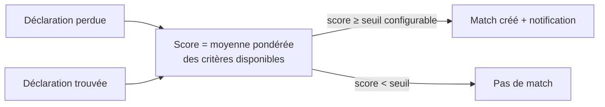

# P0-02 — Études de cas : RelanceAuto et ReTurn

## Ce qui a été fait
- Lecture des dépôts publics `ItxMveng/ReTurn` et `ItxMveng/RelanceAuto` (code, workflows, schéma SQL), vérification des URL publiques.
- `docs/portfolio/etude-de-cas-return.md` : extraction Mistral Vision, rapprochement multicritère renormalisé, vérification d'identité avant messagerie, CI/CD sur Render et GitHub Pages.
- `docs/portfolio/etude-de-cas-relanceauto.md` : moteur de séquences de relance, envoi SMTP chiffré, mode simulation, passe planifiée idempotente.
- Écart constaté et signalé : le profil de référence décrit RelanceAuto sur n8n (Docker, PostgreSQL, Cloudflare Tunnel), alors que le dépôt public contient une application Next.js + PostgreSQL (Neon). L'étude de cas décrit le dépôt, pas le profil.

## Pourquoi ce choix plutôt que l'alternative courante
L'alternative courante est de reprendre les README existants, qui contiennent des affirmations non mesurées (gains de poids d'APK, etc.) et un vocabulaire marketing. Ici, chaque affirmation est rattachée à un fichier précis, et les limites sont dites franchement (par exemple : la CI de ReTurn ne lance pas pytest). Un recruteur technique qui ouvre le dépôt retrouve exactement ce qui est écrit.

## Schéma — rapprochement ReTurn

## 5 questions d'entretien
1. **Dans ReTurn, pourquoi renormaliser les poids sur les critères disponibles ?**
   Beaucoup de déclarations n'ont pas de GPS ou de date. Avec des poids fixes, l'absence d'un critère ferait chuter le score et on raterait de vrais matchs. En divisant par la somme des poids présents, le score reste comparable entre une déclaration complète et une déclaration partielle.
2. **Pourquoi la clé Mistral Vision passe-t-elle par le backend et pas par l'application mobile ?**
   Tout ce qui est embarqué dans un APK peut être extrait. Une clé dans l'application serait récupérée et utilisée à mes frais. Le backend sert de proxy, applique l'authentification et peut limiter les appels.
3. **Dans RelanceAuto, comment évites-tu d'envoyer deux fois le même e-mail ?**
   Avant l'envoi, une requête `update ... set status = 'sending' where id = $1 and status = 'scheduled' returning id` « réserve » le message. Si deux passes tournent en même temps, une seule obtient la ligne ; l'autre passe au message suivant. C'est un verrou optimiste porté par la base.
4. **Pourquoi un mode simulation ?**
   L'utilisateur peut voir sa séquence se dérouler (en avançant le temps) sans connecter sa messagerie ni risquer d'envoyer un message raté à un vrai prospect. Cela réduit la friction de démarrage et les erreurs.
5. **Quelle est la principale faiblesse de ces deux projets du point de vue MLOps ?**
   Aucun des deux n'a d'évaluation chiffrée : on ne mesure ni l'exactitude de l'extraction et du rapprochement (ReTurn), ni l'effet des relances (RelanceAuto). Et la CI de ReTurn ne lance pas les tests. Les projets de la campagne corrigent précisément cela : jeu de test, métriques, évaluation en CI.
