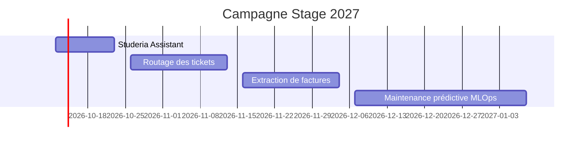

# P0-03 — Section « En construction »

## Ce qui a été fait
`docs/portfolio/en-construction.md` liste les 4 projets de la campagne avec leurs dates, le problème traité, ce qui est construit et le dépôt. Le texte est au futur ou au présent progressif : aucun résultat n'est annoncé.

## Pourquoi ce choix plutôt que l'alternative courante
L'alternative courante est d'attendre que les projets soient finis pour en parler. Mais la recherche de stage se joue maintenant : un recruteur qui voit un plan daté et un dépôt public avec un journal de bord peut suivre l'avancement et juger la régularité. Le risque est de promettre trop : d'où la règle « rien n'est présenté comme terminé avant l'entrée LIVRÉ ».
Choix de placement : une fiche unique dans « Projets » plutôt qu'un article de blog, parce que la page Projets est celle que les recruteurs consultent, et qu'une fiche unique évite de mélanger projets livrés et projets en cours.

## Schéma

## 5 questions d'entretien
1. **Pourquoi ces quatre projets et dans cet ordre ?**
   Ils couvrent les quatre familles de problèmes visées par le positionnement : RAG, classification, extraction, puis la chaîne MLOps complète. L'ordre va du plus proche de mon expérience (LLM, agents au CERV) au plus éloigné (Kubernetes, ArgoCD), et chaque projet réutilise l'infrastructure du précédent (Terraform, Cloud Run, CI).
2. **Que veut dire « abstention explicite » dans Studeria Assistant ?**
   Quand les passages récupérés ne contiennent pas la réponse, l'assistant répond qu'il ne sait pas au lieu d'inventer. On le mesure avec 20 questions dont la réponse n'est pas dans le corpus : le taux d'abstention correcte est une métrique à part entière.
3. **Pourquoi un routage hybride pour les tickets plutôt qu'un LLM pour tout ?**
   Un modèle léger traite à coût quasi nul la majorité des cas faciles ; le LLM, plus cher et plus lent, n'est appelé que sous un seuil de confiance. Le gain de coût sera mesuré, pas supposé.
4. **Pourquoi des factures synthétiques plutôt que de vraies factures ?**
   La vérité terrain est exacte par construction (le script connaît chaque champ), il n'y a aucune donnée personnelle, et on peut générer des cas difficiles à volonté (remises, plusieurs taux de TVA, avoirs, scans dégradés).
5. **Qu'est-ce qui distingue le projet MLOps des trois autres ?**
   Le sujet n'est pas le modèle mais sa vie en production : registre de versions, détection de dérive, ré-entraînement déclenché, promotion après validation, déploiement GitOps et monitoring.
