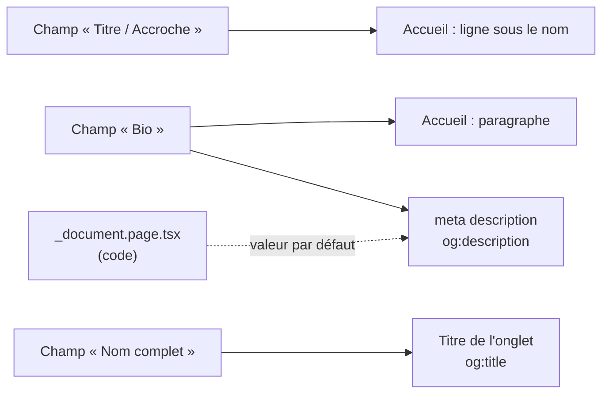

# P0-04 — Textes du site et guide d'administration

## Ce qui a été fait
- Lecture du code pour savoir d'où vient chaque texte visible : `SEOHead` (titre et méta-description), `HeroSection` (accroche, bio), `ProfileEditor` et `ProjectEditor` (champs de l'administration), `BlockEditor` (types de blocs), `_document.page.tsx` (valeurs par défaut écrites en dur).
- `docs/portfolio/textes-site.md` : nom (inchangé), accroche, bio servant aussi de méta-description, accroche de contact, et liste des textes qui ne se changent que dans le code.
- `docs/portfolio/A-COLLER-DANS-L-ADMIN.md` : pour chaque texte, l'écran, la carte et le champ exacts, avec les valeurs de titre, catégorie, slug et liens des 5 fiches projet.

## Pourquoi ce choix plutôt que l'alternative courante
L'alternative courante serait de modifier directement le code (balises meta, textes par défaut) ou d'écrire un script SQL qui met à jour Supabase. Le code n'est pas le bon endroit : le site est conçu pour être piloté par l'administration, et toute modification de code ajoute un risque de casser la production. Un script SQL écraserait sans relecture des données vivantes. Le guide garde Francis maître de ce qui est publié, et chaque chemin est vérifiable dans le code.
Découverte clé : la **Bio** sert à la fois de texte d'accueil et de méta-description. La première phrase a donc été écrite pour tenir seule dans l'extrait Google.

## Schéma

## 5 questions d'entretien
1. **Pourquoi la méta-description dépend-elle d'un champ de base de données ?**
   Le composant `SEOHead` lit le profil dans Supabase et met à jour les balises `meta` côté client. L'avantage : on change le texte sans redéployer. L'inconvénient : un robot qui n'exécute pas le JavaScript voit la valeur par défaut écrite dans `_document.page.tsx`.
2. **Comment corrigerais-tu ce point pour le référencement ?**
   Générer les balises côté serveur (`getServerSideProps` ou génération statique avec revalidation) à partir de Supabase, pour que le HTML initial contienne déjà la bonne description. C'est une modification de code, à faire avec un `npm run build` vert et une vérification en préproduction.
3. **Pourquoi limiter la première phrase à environ 155 caractères ?**
   Google tronque l'extrait affiché autour de cette longueur. Le message principal (le positionnement) doit être lisible en entier dans les résultats et les aperçus LinkedIn.
4. **Pourquoi ne pas avoir écrit un script SQL pour tout mettre à jour d'un coup ?**
   Un script modifie des données de production sans relecture visuelle et peut écraser un contenu ajouté depuis. Le collage par l'administration est plus lent mais réversible et contrôlé. Pour un changement massif, je ferais un script idempotent dans une transaction, testé d'abord sur une copie.
5. **Pourquoi l'assistant du site est-il concerné par ces textes ?**
   La route `/api/mistral` construit son contexte à partir du profil et des projets publiés. Changer la bio ou publier une fiche change donc ce que l'assistant répond, sans toucher à son code. C'est aussi pour cela qu'un projet en cours ne doit pas être décrit comme terminé.
