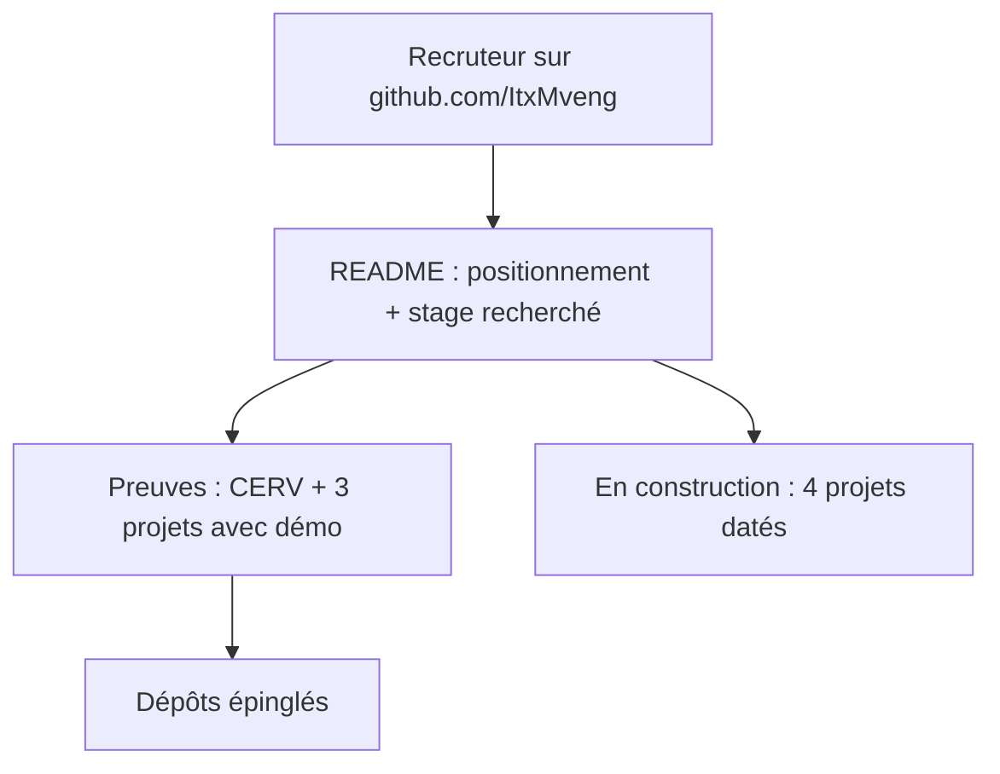

# P0-05 — README de profil GitHub

## Ce qui a été fait
- Création du dépôt public `ItxMveng/ItxMveng` : GitHub affiche son `README.md` en haut de la page de profil https://github.com/ItxMveng.
- Contenu : positionnement, recherche de stage (6 mois, février 2027), expérience CERV, 3 projets existants avec liens (dépôt + démo), tableau « En construction » daté, outils réellement utilisés dans un projet ou une expérience.
- Dépôts à épingler (action manuelle, impossible en ligne de commande) : portfolio, ReTurn, RelanceAuto, puis studeria-assistant.

## Pourquoi ce choix plutôt que l'alternative courante
L'alternative courante est un README de profil chargé de badges, de statistiques automatiques (« langages les plus utilisés », compteurs de commits) et de GIF. Ces statistiques ne prouvent rien sur la capacité à mettre de l'IA en production et ralentissent la lecture. Ici : un positionnement en une phrase, des liens vers des preuves, un plan daté. La liste d'outils ne contient que ce qu'un projet ou une expérience démontre ; Kubernetes, Terraform ou Qdrant n'y seront ajoutés qu'une fois un projet livré.

## Schéma

## 5 questions d'entretien
1. **Comment fonctionne un README de profil GitHub ?**
   Un dépôt public qui porte exactement le nom du compte (`ItxMveng/ItxMveng`) et contient un `README.md` : GitHub l'affiche en tête de la page de profil.
2. **Pourquoi ne pas lister toutes les technologies que tu connais ?**
   Une liste longue est invérifiable et dilue le message. Je ne cite que ce qu'un projet public ou une expérience prouve ; en entretien, chaque mot de la liste doit pouvoir être relié à un dépôt.
3. **Pourquoi afficher des projets pas encore terminés ?**
   Pour montrer la trajectoire et permettre de suivre l'avancement réel (dépôts publics, journal de bord). Ils sont clairement marqués « en construction » avec des dates, sans aucun résultat annoncé.
4. **Quel projet mettrais-tu en avant pour un poste d'ingénieur IA, et pourquoi ?**
   Aujourd'hui l'agent multimodal du CERV (LLM, graphe de connaissances, voix) et l'assistant Mistral du portfolio. Dès sa livraison, Studeria Assistant, parce qu'il apporte ce qui manque aux autres : une évaluation chiffrée.
5. **Que manque-t-il encore à ce profil pour un poste MLOps ?**
   Des preuves d'évaluation automatisée en CI, de déploiement par infrastructure as code, de monitoring en production et de gestion du cycle de vie d'un modèle. C'est exactement ce que couvrent les quatre projets en construction.
