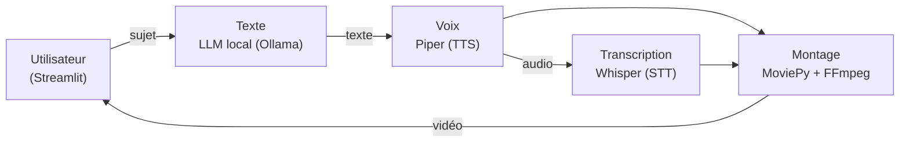

# Pipeline de génération vidéo (Studeria)

> Étude de cas prête à coller dans l'administration (Projets › Nouveau projet). Ce projet n'a pas de dépôt public : la description s'en tient aux briques déclarées dans le profil de référence, sans chiffre et sans lien.

**Description courte (carte)** : Chaîne locale qui produit des vidéos à partir d'un sujet : LLM local (Ollama), synthèse vocale (Piper), transcription (Whisper), montage (MoviePy, FFmpeg), pilotée depuis un tableau de bord Streamlit.

## Problème
Produire régulièrement des vidéos courtes (explications, tutoriels, contenus de marque) demande d'écrire un script, de l'enregistrer, de le sous-titrer et de le monter. Pour une petite structure, chaque vidéo mobilise du temps de travail répétitif ou un prestataire, et les outils en ligne facturent à l'usage et envoient les contenus chez un tiers.

## Approche
- **Briques locales** : la génération de texte passe par un LLM local servi par Ollama, sans envoyer le contenu à une API externe ni payer à l'appel.
- **Synthèse vocale** avec Piper et **transcription** de l'audio avec Whisper.
- **Montage automatisé** avec MoviePy et FFmpeg.
- **Pilotage** de la chaîne depuis un tableau de bord Streamlit.

## Architecture

## Résultats (vérifiables)
- Aucun résultat chiffré publié pour ce projet. La chaîne n'a pas de démo publique.

## Démo / lien
Pas de dépôt public ni de démo en ligne à ce jour.

## Stack
Python · Ollama (LLM local) · Piper (synthèse vocale) · Whisper (transcription) · MoviePy · FFmpeg · Streamlit.

## Limites et suite
- Pas de mesure publiée (durée de production d'une vidéo, qualité perçue) : à instrumenter avant d'en parler en chiffres.
- Pas de dépôt public : publier une version nettoyée (sans contenus clients) avec un README et une courte vidéo de démonstration rendrait le projet vérifiable.
- Pipeline séquentiel : une file de tâches permettrait de lancer plusieurs vidéos et de reprendre une étape en échec.
