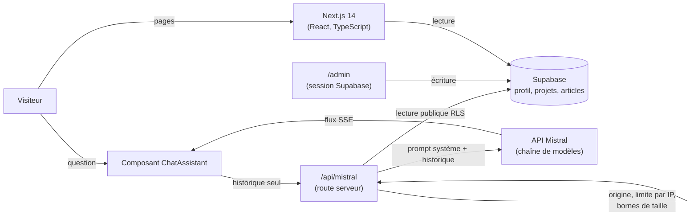

# Portfolio orienté IA, avec un assistant Mistral

> Étude de cas prête à coller dans l'administration (Projets › Nouveau projet). Chaque fait renvoie au code du dépôt `ItxMveng/portfolio`.

**Description courte (carte)** : Portfolio administrable (Next.js, Supabase) avec un assistant conversationnel Mistral qui répond à partir du contenu publié, derrière un proxy serveur protégé.

## Problème
Un recruteur qui découvre un candidat a des questions précises (« A-t-il déjà utilisé Neo4j ? », « Quel projet ressemble à notre besoin ? ») et peu de temps pour fouiller les pages. Un site statique l'oblige à chercher ; un assistant branché sans précaution sur une API LLM expose une clé, peut être détourné pour un usage arbitraire et peut répondre des choses fausses sur le candidat.
Pour un indépendant ou une petite équipe, le même problème se pose avec un site vitrine : chaque modification de contenu passe par un développeur, et un chatbot mal protégé se transforme en facture d'API.

## Approche
- **Contenu administrable** : profil, atouts, services, projets (en blocs : titres, paragraphes, code, choix techniques…), articles, certifications et messages de contact sont stockés dans Supabase et modifiés depuis un tableau d'administration `/admin`, sans redéploiement.
- **Assistant ancré dans le contenu publié** : la route serveur `/api/mistral` construit elle-même le prompt système à partir des seules données publiées (profil, atouts, services, projets, articles), lues avec la clé anonyme et soumises aux règles RLS. Le navigateur n'envoie que l'historique de conversation : il ne peut pas injecter son propre prompt système.
- **Protection du proxy** : clé Mistral uniquement côté serveur (`MISTRAL_API_KEY`, jamais en `NEXT_PUBLIC_`), vérification de l'origine, limitation du nombre de requêtes par IP, historique et longueur des messages bornés, nombre de tokens de réponse borné.
- **Résilience** : chaîne de modèles (modèle configuré, puis `mistral-small-latest`, puis `open-mistral-nemo`) avec bascule automatique sur les erreurs de quota ou d'indisponibilité ; réponse diffusée en streaming (SSE).
- **Sécurité des données** : script de durcissement Supabase (RLS sur toutes les tables, écriture réservée au compte administrateur, inscription publique désactivée) et en-têtes HTTP de sécurité dans `vercel.json`.

## Architecture

## Résultats (vérifiables)
- Site en ligne : https://francisitoua.vercel.app (accessible le 10/10/2026).
- Assistant disponible sur toutes les pages publiques ; contexte reconstruit côté serveur et mis en cache (`src/lib/assistant-context.ts`).
- Contenu entièrement modifiable depuis `/admin` (profil, atouts, services, certifications, projets, articles, messages).
- Aucune mesure de qualité des réponses n'a encore été faite : c'est la limite principale (voir plus bas).

## Démo / lien
- Site : https://francisitoua.vercel.app (bouton de l'assistant en bas de page)
- Code : https://github.com/ItxMveng/portfolio

## Stack
Next.js 14 · React 18 · TypeScript · styled-components · Framer Motion · Supabase (Postgres, Auth, Storage, RLS) · Prisma · API Mistral (streaming SSE) · Vercel.

## Limites et suite
- **Pas d'évaluation** : on ne sait pas mesurer aujourd'hui si l'assistant invente un fait sur le profil. Le projet Studeria Assistant (en cours) construit exactement cette brique : jeu de questions, abstention explicite, citations des sources ; elle pourra être reportée ici.
- **Contexte injecté en entier** dans le prompt : simple et suffisant pour un portfolio, mais ne passe pas à l'échelle d'un gros corpus (c'est la raison d'un RAG avec recherche hybride dans Studeria Assistant).
- **Limitation par IP en mémoire d'instance** : best-effort sur une plateforme serverless ; une limite partagée (Redis, Upstash) serait plus robuste.
- Pas de traces des appels LLM (latence, coût) : à ajouter avec Langfuse.
