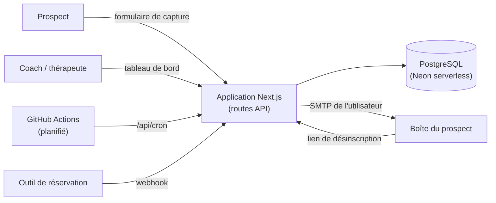

# RelanceAuto — relances automatiques des demandes de contact

> Étude de cas prête à coller dans l'administration (Projets › Nouveau projet, ou Éditer si le projet existe déjà). Chaque fait renvoie au dépôt `ItxMveng/RelanceAuto`.

**Description courte (carte)** : Application web qui relance automatiquement, par e-mail, les prospects d'un coach ou d'un thérapeute jusqu'à la prise de rendez-vous, avec mode simulation, fenêtre d'envoi et désinscription en un clic.

## Problème
Un coach ou un thérapeute indépendant reçoit des demandes de contact (formulaire, réseaux sociaux, bouche-à-oreille), répond une fois, puis n'a pas le temps de relancer. Une partie de ces prospects ne réserve jamais, faute d'une deuxième ou troisième relance au bon moment. Chaque prospect non relancé est un rendez-vous, donc un revenu, perdu sans que personne ne le voie.

## Approche
- **Séquence de relances par prospect** (`app/src/lib/engine.ts`) : à la création d'un contact (saisie manuelle, formulaire de capture public ou import), les messages de la séquence sont planifiés avec des délais croissants. Les modèles sont personnalisés (prénom, activité, lien de réservation) et le ton est réglable.
- **Arrêt automatique** : un contact qui réserve (webhook de prise de rendez-vous), répond ou se désinscrit sort de la séquence ; les messages restants sont ignorés.
- **Envoi par le propre SMTP de l'utilisateur** (Gmail, Outlook, OVH, IONOS… préréglés), mot de passe chiffré en AES-256-GCM en base, envoi limité à une fenêtre horaire (heure de Paris), lien de désinscription dans chaque e-mail.
- **Mode simulation** : l'utilisateur peut faire « avancer le temps » pour voir la séquence se dérouler sans envoyer de vrai e-mail avant de connecter sa messagerie.
- **Exécution planifiée** : une route `/api/cron` traite les messages arrivés à échéance ; un workflow GitHub Actions l'appelle périodiquement. Chaque message est « réservé » par une mise à jour conditionnelle avant envoi, pour éviter un double envoi si deux passes se chevauchent.
- **Tableau de bord** : entonnoir (contactés, relancés, réservés), activité récente, contacts, boîte d'envoi, éditeur de séquence ; limitation de débit sur les routes publiques.

## Architecture

## Résultats (vérifiables)
- Application en ligne : https://relance-auto-green.vercel.app (accessible le 10/10/2026), avec inscription, essai et pages légales.
- Workflow de passe planifiée présent dans `.github/workflows/cron.yml`.
- Aucun chiffre d'usage (taux de réservation, volume envoyé) n'est publié.

## Démo / lien
- Application : https://relance-auto-green.vercel.app
- Code : https://github.com/ItxMveng/RelanceAuto

## Stack
Next.js 14 (App Router, routes API) · TypeScript · PostgreSQL (Neon serverless) · Nodemailer · Zod · jose (sessions) · bcryptjs · AES-256-GCM (node:crypto) · Vercel · GitHub Actions.

## Limites et suite
- Aucune mesure d'efficacité publiée : il faudrait suivre, sur des comptes réels et avec leur accord, la part de prospects qui réservent avec et sans relance.
- Pas de tests automatisés dans le dépôt : les règles de planification (délais, fenêtre d'envoi, arrêt de séquence) sont de bons candidats pour des tests unitaires.
- Modèles de messages fixes : une variante générée par LLM à partir du message du prospect est une piste, à condition d'en évaluer le ton et la justesse avant envoi.
