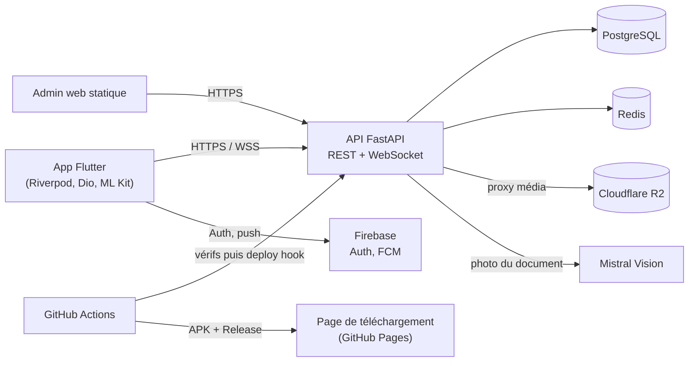

# ReTurn — restitution sécurisée de documents perdus

> Étude de cas prête à coller dans l'administration (Projets › Nouveau projet, ou Éditer si le projet existe déjà). Chaque fait renvoie au dépôt `ItxMveng/ReTurn`.

**Description courte (carte)** : Application mobile Flutter et API FastAPI qui rapprochent documents perdus et trouvés : lecture des documents par Mistral Vision, rapprochement multicritère, vérification d'identité avant tout échange.

## Problème
Perdre une carte d'identité, un passeport ou un permis déclenche une procédure de remplacement longue et payante, alors que le document a souvent été ramassé par quelqu'un qui n'a aucun moyen fiable de le rendre. Un simple « mur d'annonces » ne suffit pas : publier les informations d'un document d'identité expose son propriétaire à l'usurpation.
Pour une administration, une université ou un réseau de transport, le coût est double : le temps passé à gérer les objets trouvés et le risque de remettre un document à la mauvaise personne.

## Approche
- **Extraction des informations par IA** : le backend envoie la photo du document à Mistral Vision (clé côté serveur uniquement) pour en extraire les champs structurés (`backend/app/services/ocr_service.py`), avec un repli ML Kit sur l'appareil quand le réseau manque.
- **Rapprochement multicritère** (`backend/app/services/matching_service.py`) : numéro de document, nom du propriétaire (comparaison tolérante à la casse, aux accents et aux noms partiels), proximité géographique (haversine) et cohérence des dates. Les poids sont renormalisés sur les critères réellement disponibles : un critère absent ne pénalise pas le score. Les seuils sont paramétrables depuis la table `app_config`. Le rapprochement est limité aux déclarations d'un même pays.
- **Confiance avant tout échange** : vérification d'identité adaptative (questions de contrôle, selfie, pièce justificative), messagerie débloquée seulement après vérification (contrôle côté REST et WebSocket), images floutées par bandeaux tant que l'identité n'est pas confirmée.
- **Industrialisation** : quatre workflows GitHub Actions — vérifications puis déploiement de l'API sur Render, build de l'APK et publication d'une Release sur tag, publication de la page de téléchargement sur GitHub Pages, ping de maintien en éveil.

## Architecture

## Résultats (vérifiables)
- Page de présentation et de téléchargement en ligne : https://itxmveng.github.io/ReTurn/ (accessible le 10/10/2026).
- Dernière version publiée sur GitHub : v1.5.3 (Releases du dépôt).
- API publique sur Render avec documentation Swagger (`/docs`) ; offre gratuite, l'API peut être en veille au premier appel.
- Tests pytest présents dans `backend/tests/` (authentification, déclarations, rapprochement, restitution, signalements, administration).
- Aucune mesure de qualité de l'extraction ou du rapprochement n'est publiée à ce jour.

## Démo / lien
- Présentation et APK : https://itxmveng.github.io/ReTurn/
- Code : https://github.com/ItxMveng/ReTurn

## Stack
Flutter (Riverpod, Freezed, GoRouter, Dio, ML Kit) · FastAPI · SQLAlchemy async · Alembic · Pydantic · WebSockets · PostgreSQL · Redis · Cloudflare R2 · Firebase Auth et FCM · Mistral Vision · Docker Compose (environnement local) · Render · GitHub Actions · GitHub Pages.

## Limites et suite
- **Pas d'évaluation chiffrée** de l'extraction (exactitude par champ) ni du rapprochement (faux positifs, faux négatifs) : un jeu de déclarations annotées permettrait de régler les seuils sur des mesures plutôt qu'à l'intuition. Le projet d'extraction de factures de la campagne applique cette méthode.
- **La CI n'exécute pas encore les tests pytest** : elle vérifie la compilation et le chargement des routes avant de déployer. Ajouter `pytest` avec une base PostgreSQL de service est la prochaine étape.
- Floutage des images par bandeaux génériques : un floutage piloté par les coordonnées des champs détectés est prévu.
- Hébergement sur l'offre gratuite de Render : mise en veille compensée par un ping périodique, à remplacer par un hébergement adapté pour un usage réel.
